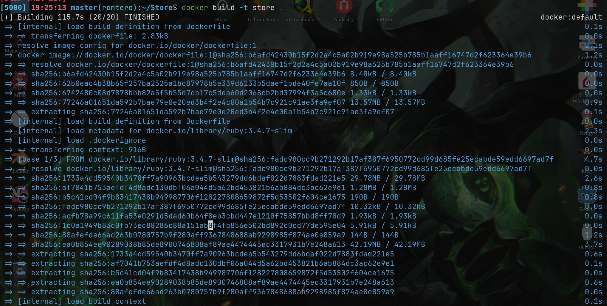
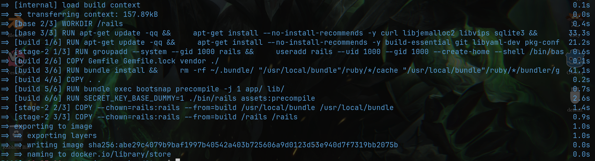
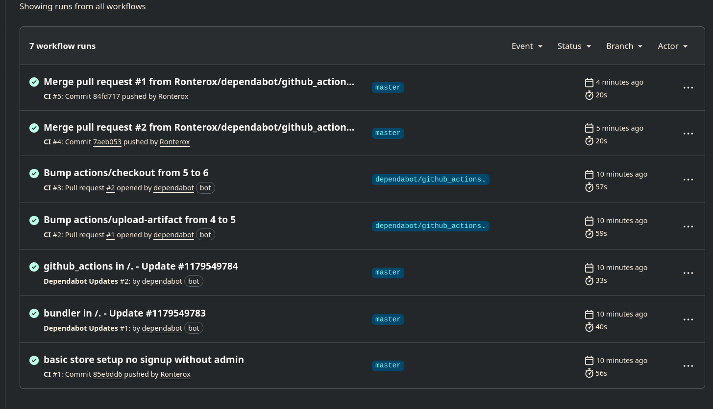
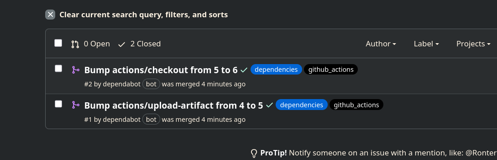
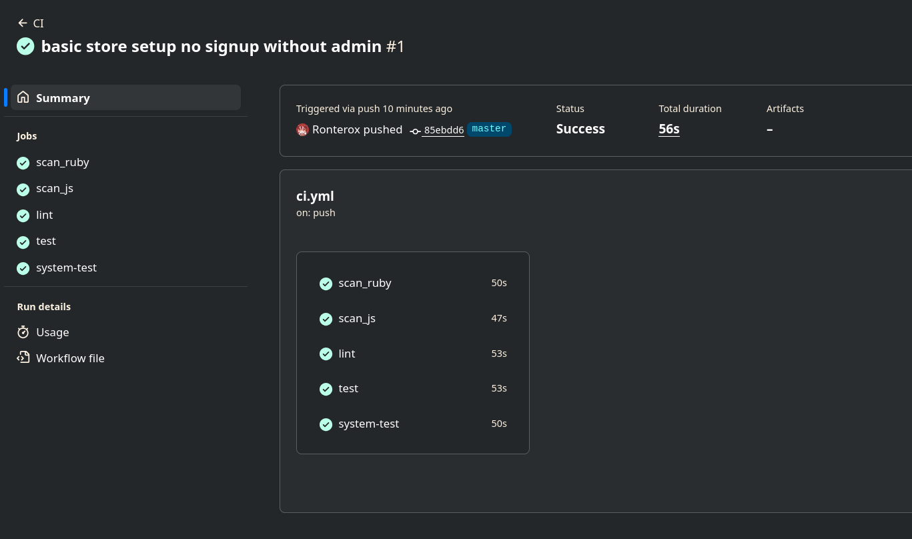
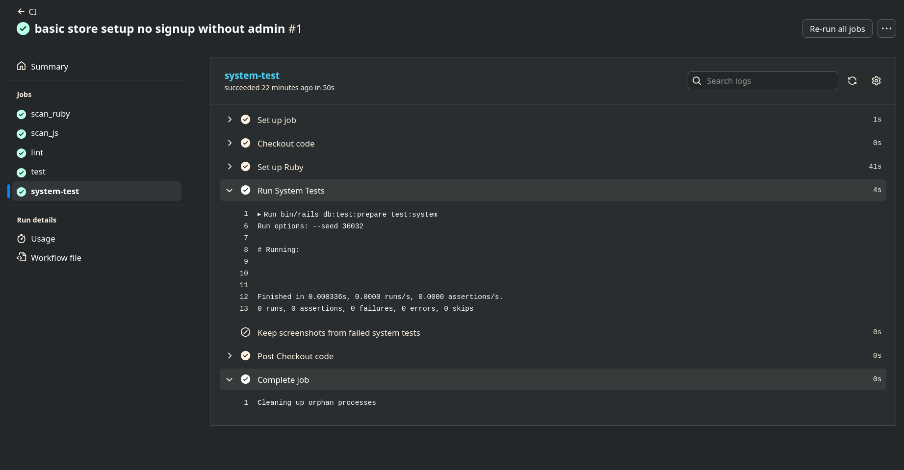

# Informe Técnico: Implementación de CI/CD con Docker para Aplicaciones Ruby on Rails

## 1\. Fundamentos de CI/CD y Docker

### 1.1 Integración Continua (CI) y Entrega Continua (CD)

La **Integración Continua (CI)** es la práctica de automatizar la fusión de cambios de código de múltiples desarrolladores en un repositorio central. Esto implica la ejecución automática de pruebas (unitarias, de integración y de seguridad) y linters para asegurar que el nuevo código no rompa la funcionalidad existente.

La **Entrega Continua (CD)** expande la CI desplegando automáticamente todos los cambios de código en un entorno de pruebas o producción después de la etapa de construcción.

### 1.2 Docker en el ciclo de vida del software

Docker permite empaquetar una aplicación y sus dependencias en una unidad estandarizada llamada "contenedor". Esto resuelve el problema de "funciona en mi máquina", asegurando consistencia entre desarrollo, pruebas y producción.

-----

## 2\. Configuración del Pipeline de CI/CD utilizando Docker

Para este proyecto, hemos configurado un entorno contenerizado utilizando un `Dockerfile` optimizado para producción. A continuación, se detallan las etapas clave configuradas en el archivo:

### 2.1 Análisis del Dockerfile (Multi-stage Build)

Se utiliza una estrategia de construcción en múltiples etapas para reducir el tamaño final de la imagen y mejorar la seguridad.

**Etapa Base y Dependencias:**
Definimos la versión de Ruby y las librerías del sistema necesarias (`libjemalloc`, `sqlite3`).

```dockerfile
ARG RUBY_VERSION=3.4.7
FROM docker.io/library/ruby:$RUBY_VERSION-slim AS base
# ... instalación de paquetes base ...
ENV RAILS_ENV="production" \
    BUNDLE_DEPLOYMENT="1" \
    LD_PRELOAD="/usr/local/lib/libjemalloc.so"
```

**Etapa de Construcción (Build Stage):**
Aquí se instalan las gemas y se precompilan los assets. Esta etapa se descarta en la imagen final, dejando solo los artefactos necesarios.

```dockerfile
FROM base AS build
# ... instalación de gemas ...
RUN bundle install && \
    rm -rf ~/.bundle/ "${BUNDLE_PATH}"/ruby/*/cache
RUN bundle exec bootsnap precompile -j 1 app/ lib/
RUN SECRET_KEY_BASE_DUMMY=1 ./bin/rails assets:precompile
```

**Etapa Final (Runtime):**
Se crea un usuario no root (`rails`) por seguridad y se configura el punto de entrada.

```dockerfile
FROM base
# ... creación de usuario rails ...
USER 1000:1000
ENTRYPOINT ["/rails/bin/docker-entrypoint"]
EXPOSE 80
CMD ["./bin/thrust", "./bin/rails", "server"]
```

> *A continuación, se muestra la ejecución manual del comando `docker build -t store .` en la terminal local para verificar que la imagen se construye correctamente antes de subirla al CI.*





-----

## 3\. Integración de Docker con GitHub Actions

Hemos seleccionado **GitHub Actions** como herramienta de CI/CD por su integración nativa con el repositorio. El flujo de trabajo (`workflow`) se dispara en eventos `push` a la rama `master` y en `pull_requests`.

### 3.1 Estructura del Workflow

El archivo `.github/workflows/ci.yml` define varios trabajos (*jobs*) paralelos para asegurar la calidad del código antes de construir la imagen Docker.

1.  **scan\_ruby:** Análisis estático de seguridad (SAST).
2.  **scan\_js:** Auditoría de dependencias JavaScript.
3.  **lint:** Verificación de estilo de código con RuboCop.
4.  **test / system-test:** Ejecución de pruebas unitarias y de sistema.

```yaml
jobs:
  test:
    runs-on: ubuntu-latest
    steps:
      - name: Checkout code
        uses: actions/checkout@v6
      - name: Set up Ruby
        uses: ruby/setup-ruby@v1
        with:
          bundler-cache: true
      - name: Run tests
        run: bin/rails db:test:prepare test
```





-----

## 4\. Automatización: Construcción, Pruebas y Despliegue

En este apartado unificamos las pruebas de seguridad definidas en el workflow con la fase de construcción y despliegue de la imagen Docker (CD).

### 4.1 Pruebas de Seguridad (DevSecOps)

Es imperativo incluir seguridad desde el inicio. Tu configuración actual ya incluye herramientas robustas:

  * **Brakeman:** Escanea vulnerabilidades comunes en Rails (Inyecciones SQL, XSS).
  * **Bundler-audit:** Revisa versiones de gemas con vulnerabilidades conocidas.
  * **Importmap audit:** Revisa vulnerabilidades en paquetes JS.

```yaml
      - name: Scan for common Rails security vulnerabilities using static analysis
        run: bin/brakeman --no-pager

      - name: Scan for known security vulnerabilities in gems used
        run: bin/bundler-audit
```

### 4.2 Automatización del Despliegue (CD Pipeline)

Para completar el ciclo, se debe agregar un trabajo de "Build & Push" que se ejecute solo si las pruebas pasan.

```yaml
  # Nuevo Job sugerido para CD
  build-and-push:
    needs: [test, system-test, scan_ruby, scan_js, lint]
    runs-on: ubuntu-latest
    if: github.ref == 'refs/heads/master'
    steps:
      - name: Checkout
        uses: actions/checkout@v4

      - name: Login to Docker Hub
        uses: docker/login-action@v3
        with:
          username: ${{ secrets.DOCKER_USERNAME }}
          password: ${{ secrets.DOCKER_PASSWORD }}

      - name: Build and push
        uses: docker/build-push-action@v5
        with:
          context: .
          push: true
          tags: user/store:latest
```





-----

## La implementación de este pipeline asegura que.

1.  Ningún código inseguro (detectado por Brakeman/Audit) llegue a producción.
2.  La aplicación siempre se pueda empaquetar correctamente en un contenedor Docker.
3.  El entorno de producción es inmutable y consistente gracias al Dockerfile multi-stage.
4.  Los paquetes de dependencias se actualizan automáticamente segun vulnerabilidades detectadas por dependabot.
